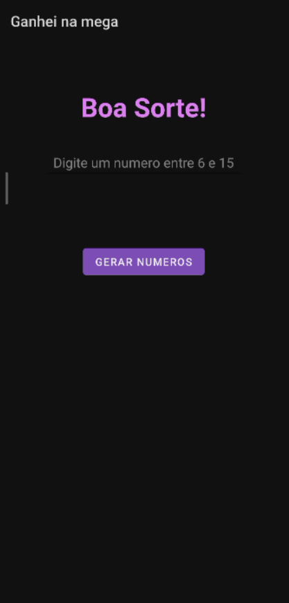
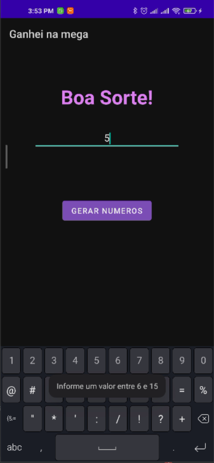
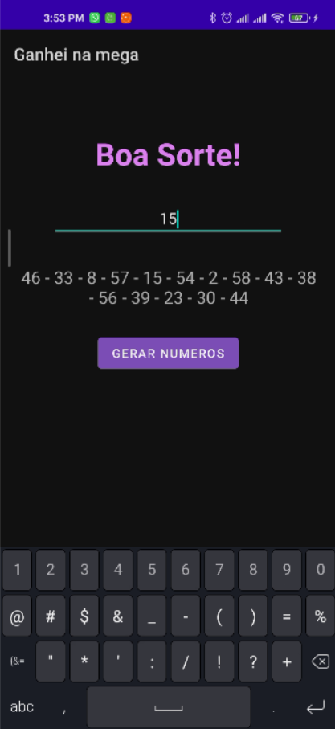
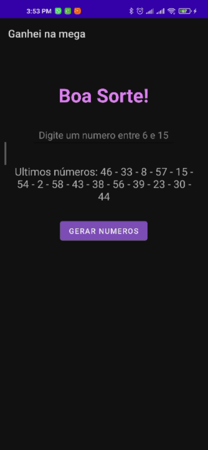

# Ganhei Na Mega

<h1>Aplicativo simples de gerar números da Maga Sena</h1>

Tela inicial:

O aplicativo apresenta respostas para input de dados que não condizem com a situação para qual o aplicativo foi criado e também aceita apenas caracteres numéricos para diminuir a gama de erros

A tela abaixo exemplifica um resultado gerado pelo aplicativo:

A aplicação também utiliza de "SharedPreferences" para manter o resultado gerado anteriomente salvo e exibi-lo na proxima vez em que o APP for inicializado

  

  
